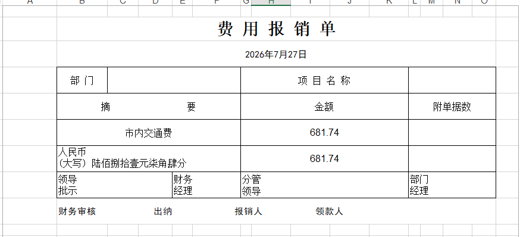

# 报销单生成（invoice2Excel）

基于 **Tauri 2 + Rust** 的 Windows 桌面工具, 用于生成报销单。

## 功能




## 构建与运行

根目录 `package.json` 提供了全部常用命令（开发命令需要先 `npm install` 安装 tauri-cli 与 vite）：

| 命令            | 作用                                                                                        |
| --------------- | ------------------------------------------------------------------------------------------- |
| `npm run dev`   | 调试运行：自动启动 Vite 开发服务器（`http://localhost:5173`）并 debug 编译启动应用，**保存即生效**——改 `ui/` 下前端文件即时热更新，改 `src-tauri/` 下 Rust 文件自动重编译并重启。注意调试请始终用本命令，直接 `cargo run` 会因没有 Vite 服务器而白屏 |
| `npm run build` | 打包：**自动先清空 `dist/`** → `cargo build --release` → 产物复制到根目录 `dist/`           |
| `npm run zip`   | 把 `dist/invoice2excel.exe`、`使用说明.txt` 与 `README.md` 打成 `dist/报销单生成.zip`       |
| `npm test`      | `cargo test`（人民币大写、日期/金额解析等单测）                                             |
| `npm run icon`  | 重新生成 `src-tauri/icons/icon.ico`（蓝色圆角方块 + 白色 ¥）                                |
| `npm run clean` | 仅清空 `dist/`                                                                              |

打包流程（`npm run build` 通过 npm 生命周期钩子自动串联）：

1. `prebuild`：`scripts/clean-dist.js` 清空根目录 `dist/`；
2. `build`：`cargo build --release`，产物为独立单文件 exe（Windows 10/11 自带 WebView2 运行时，双击即可运行）；
3. `postbuild`：`scripts/pack-dist.js` 把 `invoice2excel.exe` 和 `assets/使用说明.txt` 复制到 `dist/`。

> 说明：exe 图标由 `src-tauri/icons/icon.ico` 在编译期写入；若资源管理器显示旧图标，是 Windows 图标缓存所致，重命名 exe 或重启资源管理器即可刷新。
>
> 注意：打包前请先关闭正在运行的旧版应用——Windows 会锁定运行中的 exe，cargo 无法替换它。

## 修改预设

预设都集中在前端一个文件 `ui/app.js` 顶部，改完重新 `cargo build --release` 即可：

```js
const DEPARTMENTS = ['综合办公室', '财务部', '人力资源部', '市场部', '技术部', '采购部']
const FEE_TYPES = ['市内交通费', '餐费', '软件费']
```

## 项目结构

```
invoice2Excel/
├── ui/                    # 前端表单（原生 HTML/CSS/JS，编译期嵌入 exe）
│   ├── index.html
│   ├── style.css          # 蓝色主题（对照设计稿）
│   └── app.js             # 预设选项、校验、预览逻辑
├── assets/
│   └── 使用说明.txt        # 源副本，打包时随 exe 一起复制到 dist/
├── scripts/               # 打包脚本：clean-dist / pack-dist / zip-dist
├── src-tauri/
│   ├── src/main.rs        # Tauri 命令：另存对话框、必填/明细过滤、文件名、打开文件夹
│   ├── src/excel.rs       # 按模板复刻的 Excel 生成（rust_xlsxwriter）
│   ├── src/rmb.rs         # 人民币大写转换（含单测）
│   ├── tauri.conf.json    # 窗口 900×860
│   └── icons/icon.ico     # 蓝色底白色¥多尺寸图标（tools/make_icon.py 生成）
├── tools/                 # 图标生成脚本
└── package.json           # npm 命令编排（dev / build / zip / test / icon）
```

## 测试

```bash
cd src-tauri
cargo test
```
